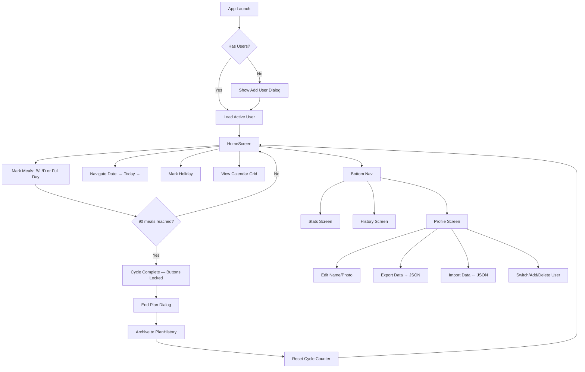

# Meal Tracker — Project Documentation

## Overview
Android Kotlin app that tracks daily meal deliveries across 90-meal cycles. Users mark Breakfast/Lunch/Dinner daily, track spending/refunds, mark holidays, and view history across cycles.

**Package:** `com.mealcycle.app`  
**Min SDK:** 26 · **Target SDK:** 34 · **Kotlin + Jetpack Compose + Hilt + Room**

---

## Project Structure

```
app/src/main/java/com/mealcycle/app/
├── MainActivity.kt              # Single-activity entry point
├── MealCycleApp.kt              # @HiltAndroidApp Application class
│
├── data/
│   ├── backup/
│   │   └── DataBackupManager.kt # JSON export/import via SAF (Storage Access Framework)
│   ├── datastore/
│   │   └── UserPreferences.kt   # DataStore for activeUserId + cycle settings
│   ├── db/
│   │   ├── AppDatabase.kt       # Room database (version 3)
│   │   ├── HolidayDao.kt        # Holiday CRUD + monthly holiday counts
│   │   ├── MealEntryDao.kt      # Meal entry CRUD + monthly meal counts
│   │   ├── PlanHistoryDao.kt    # Completed plan history records
│   │   └── UserDao.kt           # User CRUD
│   ├── model/
│   │   ├── HolidayEntry.kt      # @Entity — userId + date
│   │   ├── MealEntry.kt         # @Entity — userId + date + mealType + isDelivered
│   │   ├── PlanHistory.kt       # @Entity — completed cycle snapshot
│   │   └── User.kt              # @Entity — userId + name + photoUri
│   └── repository/
│       ├── HistoryRepository.kt  # Wraps PlanHistoryDao
│       ├── HolidayRepository.kt  # Wraps HolidayDao (incl. monthly counts)
│       ├── MealRepository.kt     # Wraps MealEntryDao (incl. monthly counts)
│       └── UserRepository.kt     # Wraps UserDao
│
├── di/
│   └── DatabaseModule.kt        # Hilt @Module — provides Room DB + DAOs
│                                 # ⚠️ Uses explicit migrations (1→3, 2→3)
│
├── ui/
│   ├── calendar/
│   │   └── CalendarView.kt      # Monthly calendar grid with meal/holiday indicators
│   ├── history/
│   │   ├── HistoryScreen.kt     # Year-grouped expandable plan history
│   │   └── HistoryViewModel.kt
│   ├── home/
│   │   ├── HomeScreen.kt        # Main screen — greeting, stats, progress, calendar, meals
│   │   ├── HomeViewModel.kt     # Drives HomeScreen state + meal toggling
│   │   ├── MealButtons.kt       # Breakfast/Lunch/Dinner toggle + Full Day
│   │   ├── ProgressBar.kt       # Shimmer progress bars (Cycle + Remaining Days)
│   │   ├── StatsCards.kt        # Delivered/Remaining/Time/Spent/Refund cards
│   │   ├── CycleSettingsDialog.kt # Edit total meals + price per meal
│   │   └── EndPlanDialog.kt     # Confirm end plan → archives to history
│   ├── navigation/
│   │   └── NavGraph.kt          # Compose Navigation graph (4 destinations)
│   ├── profile/
│   │   ├── ProfileScreen.kt     # User management + edit + export/import
│   │   └── ProfileViewModel.kt
│   ├── stats/
│   │   ├── UsageStatsScreen.kt  # Monthly meal bars + holiday counts
│   │   └── UsageStatsViewModel.kt
│   └── theme/
│       ├── Color.kt             # Brand colors + gradients + semantic tokens
│       ├── Theme.kt             # Material3 theme setup
│       └── Type.kt              # Poppins typography
│
└── utils/
    └── MealCalculations.kt      # Pure stateless math (remaining, refund, progress %)
```

---

## App Flow



---

## Data Flow

```
UserPreferences.activeUserId (DataStore)
        │
        ▼
   ViewModel (flatMapLatest by userId)
        │
        ├─► MealRepository.getMealsForUser(userId)
        ├─► HolidayRepository.getAllHolidays(userId)
        └─► MealRepository.getDeliveredCount(userId)
                │
                ▼
         StateFlow<UiState>  ──►  Composable Screen
```

**Key pattern:** Every ViewModel observes `activeUserId` and uses `flatMapLatest` to reload data when the user switches profiles.

---

## Database Schema (Room v3)

| Table | Primary Key | Foreign Key | Description |
|-------|-------------|-------------|-------------|
| `users` | `userId` (String) | — | User profiles |
| `meal_entries` | `date + mealType + userId` | `userId → users` | Daily meal records |
| `holidays` | `date + userId` | `userId → users` | Holiday markers |
| `plan_history` | `id` (auto) | — | Archived completed cycles |

### ⚠️ Migration Rules
- **NEVER** use `fallbackToDestructiveMigration()` — it was removed because it silently wipes all user data
- All schema changes **must** add explicit `Migration(oldVersion, newVersion)` in `DatabaseModule.kt`
- If no migration exists for a version jump, the app will crash with a clear error (intentional — better than silent data loss)
- Current version: **3**

### Dark Mode
- Auto-detects system dark mode via `isSystemInDarkTheme()` in `Theme.kt`
- Dark palette defined in `Color.kt`: `DarkBackground`, `DarkSurface`, `DarkSurfaceVariant`, etc.
- All screens use `MaterialTheme.colorScheme.surface` / `.background` — no hardcoded light colors

---

## Common Bug Patterns & How to Intercept

### 1. Foreign Key Crashes
**Symptom:** `SQLiteConstraintException: FOREIGN KEY constraint failed`  
**Cause:** Trying to insert meals/holidays before user profile is loaded  
**Fix:** Always guard with `if (userId.isBlank()) return` before any DAO insert  
**Files:** `HomeViewModel.toggleMeal()`, `HomeViewModel.selectFullDay()`

### 2. Data Loss on App Update
**Symptom:** All meals/holidays gone after updating the app  
**Cause:** Room DB version bumped without migration  
**Fix:** Add explicit `Migration(old, new)` in `DatabaseModule.kt`  
**Prevention:** Never increment `AppDatabase` version without a migration

### 3. Month-Boundary Data Disappearing
**Symptom:** Data from previous month vanishes on the 1st  
**Cause:** DAO queries filtering by current month only  
**Fix:** All queries use `userId` filter, not month filter — data is plan-based, not month-based

### 4. Cycle Not Ending / Ending Early
**Symptom:** Cycle stuck or ends before 90 meals  
**Cause:** Off-by-one in `deliveredCount` or `isCycleComplete`  
**Fix:** Check `MealCalculations.isCycleComplete()` — uses `>=` not `>`

### 5. Holiday + Meal Conflict
**Symptom:** Holiday marked but meals also counted  
**Cause:** Holiday doesn't auto-block meal marking  
**Note:** This is by design — holidays are informational, meals are independent

---

## Key Constants

| Constant | Default | Location |
|----------|---------|----------|
| `DEFAULT_TOTAL_MEALS` | 90 | `MealCalculations.kt` |
| `DEFAULT_PRICE_PER_MEAL` | 50 (₹) | `MealCalculations.kt` |
| DB Version | 3 | `AppDatabase.kt` |

---

## Build & Run

```bash
# Debug build
./gradlew assembleDebug

# Install on connected device
./gradlew installDebug

# Run tests
./gradlew test
```

**Requirements:** JDK 17, Android SDK 34, Gradle 8.7
